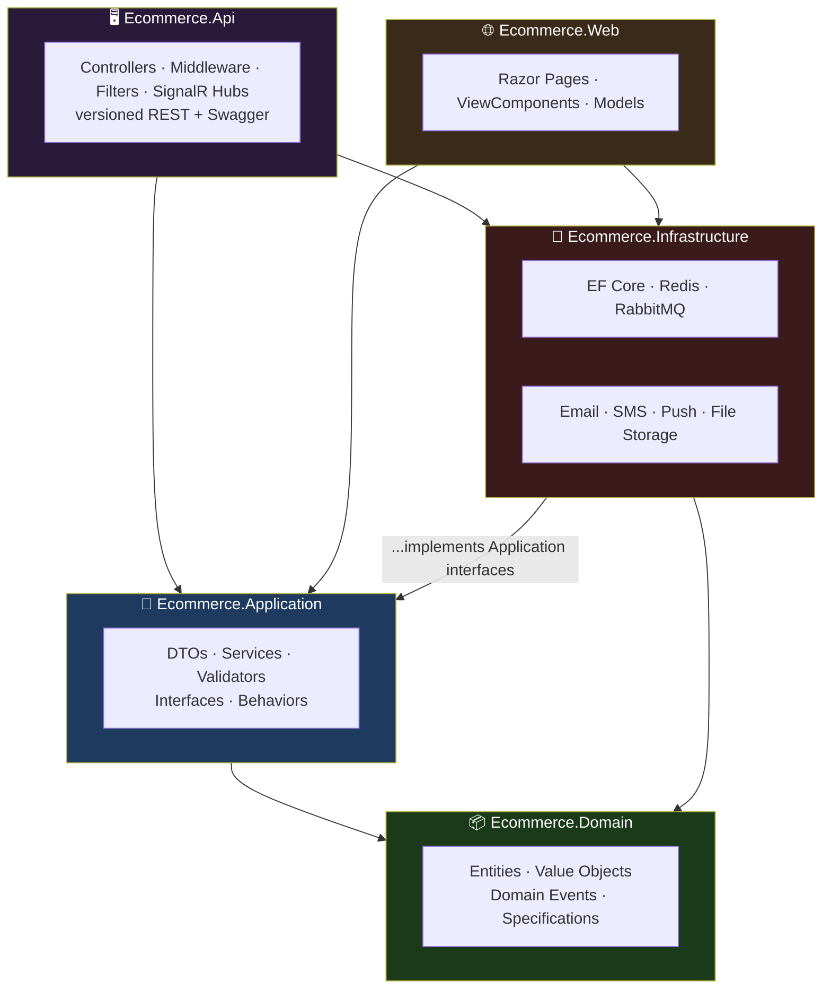
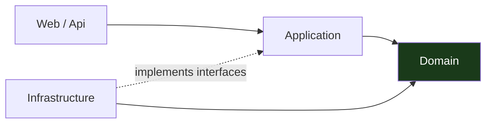
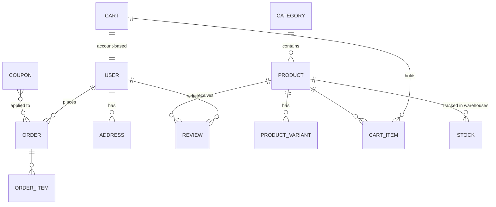
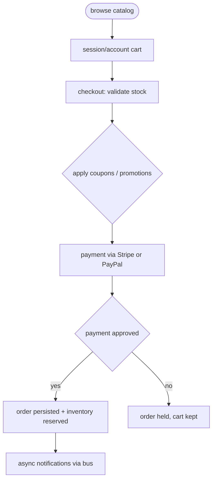
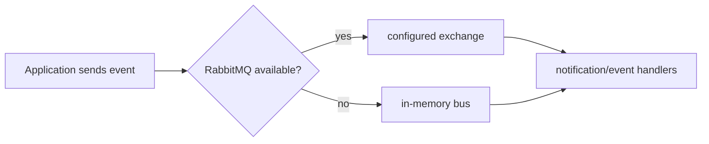

<div align="center">

**🌐 Choose Language / Selecione o Idioma / Elija el Idioma**

[](README.md)&nbsp;&nbsp;&nbsp;[](README_PT.md)&nbsp;&nbsp;&nbsp;[](README_ES.md)

</div>

---

<div align="center">

```
███████╗ ██████╗ ██████╗ ███╗   ███╗███╗   ███╗███████╗██████╗  ██████╗███████╗
██╔════╝██╔════╝██╔═══██╗████╗ ████║████╗ ████║██╔════╝██╔══██╗██╔════╝██╔════╝
█████╗  ██║     ██║   ██║██╔████╔██║██╔████╔██║█████╗  ██████╔╝██║     █████╗
██╔══╝  ██║     ██║   ██║██║╚██╔╝██║██║╚██╔╝██║██╔══╝  ██╔══██╗██║     ██╔══╝
███████╗╚██████╗╚██████╔╝██║ ╚═╝ ██║██║ ╚═╝ ██║███████╗██║  ██║╚██████╗███████╗
╚══════╝ ╚═════╝  ╚═════╝ ╚═╝     ╚═╝╚═╝     ╚═╝╚══════╝╚═╝  ╚═╝ ╚═════╝╚══════╝
        Full-featured e-commerce — .NET 8, Clean Architecture, modern C#
```

---

[](https://dotnet.microsoft.com/)
[](https://dotnet.microsoft.com/)
[]()
[]()
[]()
[]()
[]()

<br/>

> **A full-featured e-commerce solution — clean layers from catalog to checkout, payments,
> inventory, CMS and notifications.** REST API with versioning + Swagger on one side, an MVC/Razor
> Pages storefront on the other, Redis/RabbitMQ with local failover so the whole solution runs
> even with zero external infrastructure.

<br/>

-512BD4?style=flat-square)


</div>

---

## 📑 Table of Contents

<details>
<summary>▶️ <strong>Click to expand / collapse this section</strong></summary>

<table>
<tr>
<td valign="top" width="50%">

**🏗️ System**
- [Overview](#-overview)
- [System Architecture](#-system-architecture)
- [Technology Stack](#-technology-stack)
- [Design Patterns](#-design-patterns-applied)
- [Project Structure](#-project-structure)

**📦 Modules**
- [Ecommerce.Domain — Business Core](#-ecommercedomain--business-core)
- [Ecommerce.Application — Use Cases](#-ecommerceapplication--use-cases)
- [Ecommerce.Infrastructure — Adapters](#-ecommerceinfrastructure--adapters)
- [Ecommerce.Api — REST](#-ecommerceapi--rest)
- [Ecommerce.Web — Storefront](#-ecommerceweb--storefront)

**💼 Business**
- [Business Rules](#-business-rules)
- [Functional Requirements](#-functional-requirements)
- [Non-Functional Requirements](#-non-functional-requirements)

</td>
<td valign="top" width="50%">

**📐 Design**
- [Data Model](#-data-model)
- [System Flows](#-system-flows)

**🔐 Security & Ops**
- [Security](#-security)
- [Installation & Execution](#-installation--execution)
- [Automated Tests](#-automated-tests)
- [Metrics & Monitoring](#-metrics--monitoring)
- [Known Limitations](#-known-limitations)

</td>
</tr>
</table>

---

</details>

## 🌟 Overview

<details>
<summary>▶️ <strong>Click to expand / collapse this section</strong></summary>

**E-Commerce Platform** is a full-featured e-commerce solution built with **.NET 8**, **Clean Architecture**, and modern C# practice — a product catalog with categories, brands, variants and search; session-based and account-based carts; order processing with tracking and history; **Stripe and PayPal** payments; user management with profiles and addresses; marketing with coupons, promotions, banners and newsletters; product reviews, warehouse inventory, a CMS for pages/menus/settings/media, and notifications via **SendGrid, SMS (Twilio) and push**.

Two surfaces share one backend: a **versioned REST API with Swagger** (`Ecommerce.Api`) and an **MVC storefront with Razor Pages** (`Ecommerce.Web`). External services (`Redis`, `RabbitMQ`) have in-memory fallbacks, so the whole solution runs even without infrastructure.

### 🎯 System Objectives

| Objective | Description |
|-----------|-------------|
| 🛍️ **End-to-end commerce** | Catalog → cart → checkout → payment → fulfillment |
| 🧱 **Clean Architecture** | Domain/Application/Infrastructure/Api/Web, dependencies point inward |
| 💳 **Real payments** | Stripe and PayPal providers behind one abstraction |
| 🔌 **External services with failover** | Redis/RabbitMQ fall back to in-memory |
| 📦 **Complete storefront & API** | MVC storefront + versioned Swagger API |
| 🧪 **Three test tiers** | Unit, integration, and architecture tests enforce the layering |

---

</details>

## 🏗️ System Architecture

<details>
<summary>▶️ <strong>Click to expand / collapse this section</strong></summary>

### Clean Architecture Layers



### Dependency Rule



Dependencies point inward: the **Domain** knows nothing, **Application** knows the domain, **Infrastructure** adapts the outside world to Application interfaces, and **Api/Web** are thin shells.

---

</details>

## 🛠️ Technology Stack

<details>
<summary>▶️ <strong>Click to expand / collapse this section</strong></summary>

| Layer | Technology | Purpose |
|-------|-----------|---------|
| 🧠 **Language** | C# 12 / .NET 8 | Every project |
| 🗄️ **ORM** | Entity Framework Core 8 | Data access |
| 🖥️ **API** | ASP.NET Core 8, versioning, Swagger | Versioned REST |
| 🌐 **Storefront** | Razor Pages / MVC | Frontend |
| ⚡ **Caching** | Redis with in-memory fallback | Cache-aside |
| 📨 **Messaging** | RabbitMQ with in-memory fallback | Async bus |
| 💳 **Payments** | Stripe + PayPal | Checkout providers |
| ✉️ **Notifications** | SendGrid, Twilio SMS, push | Outbound comms |
| 🧪 **Testing** | xUnit, Moq, FluentAssertions | Unit / integration / architecture |
| 🐳 **Containers** | docker-compose (`docker/docker-compose.yml`) | Local full stack |

---

</details>

## 📐 Design Patterns Applied

<details>
<summary>▶️ <strong>Click to expand / collapse this section</strong></summary>

| Pattern | Where | Rationale |
|---------|-------|-----------|
| 🧱 **Clean/Onion layering** | Solution structure | Dependencies point inward; testable, replaceable |
| 🌀 **Dependency inversion** | Application interfaces + Infrastructure implementations | Redis/RabbitMQ/Email are swappable by design |
| 📡 **CQRS-lite behaviors** | Application behaviors/validators | Cross-cutting concerns (validation, logging) as pipeline |
| 🎭 **Repository + Specification** | Domain specifications, EF Core data access | Query logic stays near the domain |
| 💳 **Provider strategy** | Payment abstraction over Stripe/PayPal | One checkout path, interchangeable providers |
| 📢 **Domain events** | Domain entities | Business changes propagate without coupling |
| 🧷 **Failover adapter** | In-memory cache/bus fallbacks | Runs with zero external infrastructure |

---

</details>

## 📁 Project Structure

<details>
<summary>▶️ <strong>Click to expand / collapse this section</strong></summary>

```
ecommerce-csharp/
│
├── 📂 src/
│   ├── 📂 Ecommerce.Domain/          # entities, value objects, domain events, specs
│   ├── 📂 Ecommerce.Application/     # DTOs, services, validators, interfaces, behaviors
│   ├── 📂 Ecommerce.Infrastructure/  # EF Core, Redis, RabbitMQ, email, SMS, files
│   ├── 📂 Ecommerce.Api/             # controllers, middleware, filters, SignalR hubs
│   └── 📂 Ecommerce.Web/             # Razor Pages, ViewComponents, models
│
├── 📂 tests/
│   ├── 📂 Ecommerce.UnitTests/       # unit tests
│   ├── 📂 Ecommerce.IntegrationTests/ # integration tests
│   └── 📂 Ecommerce.ArchitectureTests/ # layer-rule enforcement
│
├── 📂 docker/
│   └── 📄 docker-compose.yml         # local full stack
│
├── 📄 README.md                      # 🇺🇸 English (primary)
├── 📄 README_PT.md                   # 🇧🇷 Português
└── 📄 README_ES.md                   # 🇪🇸 Español
```

---

</details>

## 📦 System Modules

<details>
<summary>▶️ <strong>Click to expand / collapse this section</strong></summary>

### 📦 Ecommerce.Domain — Business Core

Entities, value objects, domain events and specifications — the pure business model with no outside dependencies. Catalog, cart, order, inventory, review, marketing and CMS entities live here.

### 🧩 Ecommerce.Application — Use Cases

DTOs, application services, validators, mapping and pipeline behaviors, plus the **interfaces** that Infrastructure implements. This is where use cases are orchestrstrated while owning nothing technical.

### 🔌 Ecommerce.Infrastructure — Adapters

Data access (EF Core), Redis caching, RabbitMQ messaging, email (SendGrid), SMS (Twilio), push and file storage — every external service behind an Application interface, with in-memory fallbacks where that keeps local dev frictionless.

### 🖥️ Ecommerce.Api — REST

Controllers, middleware, filters and SignalR hubs serving a **versioned** REST API documented by Swagger at `http://localhost:5000/swagger`.

### 🌐 Ecommerce.Web — Storefront

MVC storefront built with Razor Pages: pages, ViewComponents and models consumed by shoppers, admins and CMS editors over the same Application layer the API uses.

---

</details>

## 📋 Business Rules

<details>
<summary>▶️ <strong>Click to expand / collapse this section</strong></summary>

| # | Rule | Detail |
|---|------|--------|
| **BR-01** | Quantity cannot exceed inventory | Checkout validates stock from warehouse tracking |
| **BR-02** | Cart is session-based or account-based | Anonymous carts keep state; signed-in carts persist to the account |
| **BR-03** | Payments go through Stripe or PayPal only | One payment abstraction; providers interchangeable |
| **BR-04** | Coupons and promotions apply before payment | Discounts computed at checkout, persisted with the order |
| **BR-05** | Orders have states | Processing → paid → fulfilled/tracked, with history per order |
| **BR-06** | Reviews require a rating | Product reviews carry ratings, no unrated reviews |
| **BR-07** | Newsletters and banners are campaign-driven | Marketing content is managed, scoped and schedulable |
| **BR-08** | Notifications fan out asynchronously | Email/SMS/push via RabbitMQ (or in-memory) bus, never blocking checkout |

---

</details>

## ✨ Functional Requirements

<details>
<summary>▶️ <strong>Click to expand / collapse this section</strong></summary>

| ID | Feature | Priority | Status |
|----|---------|----------|--------|
| **RF-01** | Product catalog: categories, brands, variants, images, search | 🔴 High | ✅ Implemented |
| **RF-02** | Session-based and account-based shopping cart | 🔴 High | ✅ Implemented |
| **RF-03** | Order processing, tracking and history | 🔴 High | ✅ Implemented |
| **RF-04** | Stripe and PayPal payments | 🔴 High | ✅ Implemented |
| **RF-05** | Authentication, profiles, addresses | 🔴 High | ✅ Implemented |
| **RF-06** | Coupons, promotions, banners, newsletters | 🟡 Medium | ✅ Implemented |
| **RF-07** | Product reviews with ratings | 🟡 Medium | ✅ Implemented |
| **RF-08** | Warehouse management and stock tracking | 🟡 Medium | ✅ Implemented |
| **RF-09** | CMS: pages, menus, settings, media | 🟡 Medium | ✅ Implemented |
| **RF-10** | Notifications: email (SendGrid), SMS, push | 🟡 Medium | ✅ Implemented |
| **RF-11** | Redis caching with in-memory fallback | 🟡 Medium | ✅ Implemented |
| **RF-12** | RabbitMQ messaging with in-memory fallback | 🟡 Medium | ✅ Implemented |
| **RF-13** | Versioned REST API with Swagger | 🔴 High | ✅ Implemented |
| **RF-14** | MVC storefront with Razor Pages | 🔴 High | ✅ Implemented |

---

</details>

## ⚙️ Non-Functional Requirements

<details>
<summary>▶️ <strong>Click to expand / collapse this section</strong></summary>

| ID | Category | Requirement | Target |
|----|----------|-------------|--------|
| **RNF-01** | 🧱 Maintainability | Clean Architecture layers validated by tests | Architecture tests in CI |
| **RNF-02** | ⚡ Performance | Redis cache-aside, lazy DB load | Cached reads, async writes |
| **RNF-03** | 🔌 Portability | External services swappable | In-memory failsafe cache/bus |
| **RNF-04** | 🌐 API stability | Versioned endpoints | Breaking changes behind new versions |
| **RNF-05** | 📐 Consistency | EF Core migrations | `dotnet ef database update` |
| **RNF-06** | 🧪 Quality gate | Three test tiers | Unit + integration + architecture |
| **RNF-07** | 🐳 Reproducibility | Local stack in containers | `docker-compose up --build` |

---

</details>

## 🗄️ Data Model

<details>
<summary>▶️ <strong>Click to expand / collapse this section</strong></summary>

### Aggregates



| Aggregate | Key rules |
|-----------|-----------|
| **Product / Variant** | Catalog drive — categories, brands, images, stock reference |
| **Cart** | Session or account based, items reference product variants |
| **Order** | Checkout snapshot, payment state machine, history |
| **User / Address** | Authentication, profiles, shipping addresses |
| **Review** | Product rating with text |
| **Inventory** | Warehouse + stock levels guard purchase quantities |
| **Marketing / CMS** | Coupons, promotions, banners, newsletters, pages, menus, media |

---

</details>

## 🔄 System Flows

<details>
<summary>▶️ <strong>Click to expand / collapse this section</strong></summary>

### Checkout Flow



### Message Bus Flow (with failover)



---

</details>

## 🔐 Security

<details>
<summary>▶️ <strong>Click to expand / collapse this section</strong></summary>

### Implemented Controls

| Control | Implementation | Effect |
|---------|---------------|--------|
| 🔑 **Authentication** | ASP.NET Core identity/user management | Profiles, addresses, roles |
| 💳 **Payment abstraction** | Stripe/PayPal server-side flows | No raw card data in the application |
| 📁 **Validation pipeline** | Application validators + behaviors | Malformed requests rejected at the boundary |
| 🧪 **Architecture tests** | Enforce the Clean Architecture dependency rule | No inward-leaking dependencies in CI |
| 🔌 **Secrets in config** | Connection strings/keys via `appsettings.json` | Environment-controlled configuration |

### Known Security Limitations

| Limitation | Risk | Mitigation path |
|------------|------|-----------------|
| 🛰️ **Config-driven secrets** | Production keys in `appsettings` would leak | Move to user-secrets / environment or a vault |
| 🔓 **No rate limiting** | Public endpoints open to abuse | Add API rate limiting / throttling middleware |

---

</details>

## 🚀 Installation & Execution

<details>
<summary>▶️ <strong>Click to expand / collapse this section</strong></summary>

### Getting Started

```bash
# 1. Clone the repository
# 2. Configure connection strings in appsettings.json
dotnet restore && dotnet build
dotnet ef database update        # run migrations
# 3. Start the API
dotnet run --project src/Ecommerce.Api
# 4. Start the Web storefront
dotnet run --project src/Ecommerce.Web
```

**API docs:** Swagger UI at `http://localhost:5000/swagger`

### Docker

```bash
docker-compose -f docker/docker-compose.yml up --build
```

### Tests

```bash
dotnet test
```

---

</details>

## 🧪 Automated Tests

<details>
<summary>▶️ <strong>Click to expand / collapse this section</strong></summary>

Three test tiers run the same command:

| Tier | Project | Guards |
|------|---------|--------|
| 🧩 **Unit** | `Ecommerce.UnitTests` | Behaviors, services, validators in isolation |
| 🔄 **Integration** | `Ecommerce.IntegrationTests` | EF Core, cache/bus fallbacks, real request paths |
| 🏛️ **Architecture** | `Ecommerce.ArchitectureTests` | Clean Architecture dependency rule — no inbound leaks |

```bash
dotnet test
```

---

</details>

## 📊 Metrics & Monitoring

<details>
<summary>▶️ <strong>Click to expand / collapse this section</strong></summary>

| Metric | Value |
|--------|-------|
| Solution projects | 8 (5 src + 3 test) |
| C# files | 223 |
| Architecture layers | 5 (Domain, Application, Infrastructure, API, Web) |
| Payment providers | 2 (Stripe, PayPal) |
| Messaging | RabbitMQ + in-memory fallback |
| Caching | Redis + in-memory fallback |
| Notification channels | Email (SendGrid), SMS (Twilio), push |
| Test tiers | 3 (unit, integration, architecture) |
| API | Versioned REST + Swagger |
| Storefront | MVC Razor Pages |

### Quick Commands

```bash
dotnet restore && dotnet build
dotnet ef database update
dotnet run --project src/Ecommerce.Api
dotnet run --project src/Ecommerce.Web
dotnet test
docker-compose -f docker/docker-compose.yml up --build
```

---

</details>

## ⚠️ Known Limitations

<details>
<summary>▶️ <strong>Click to expand / collapse this section</strong></summary>

| Category | Issue | Status |
|----------|-------|--------|
| 💳 **Live payment keys** | Stripe/PayPal run in test/sandbox mode until keys are configured for production | ⚠️ Configuration-based |
| 📦 **In-memory fallbacks** | Redis/RabbitMQ fallbacks are perfect for dev, not a distributed prod topology | ⚠️ Dev convenience |
| 🔄 **Async resilience** | No outbox/retry pattern for bus events yet | ⚠️ Future work |
| 📱 **No mobile/SPA client** | Storefront is MVC; API ready for other clients | ⚠️ Out of scope |

</details>

---

<div align="center">

---

### 🛒 E-Commerce Platform

*Catalog to checkout, clean architecture in between.*

[]()
[]()
[]()

<br/>

```
"Domain knows nothing; every external service is an adapter."
```

</div>