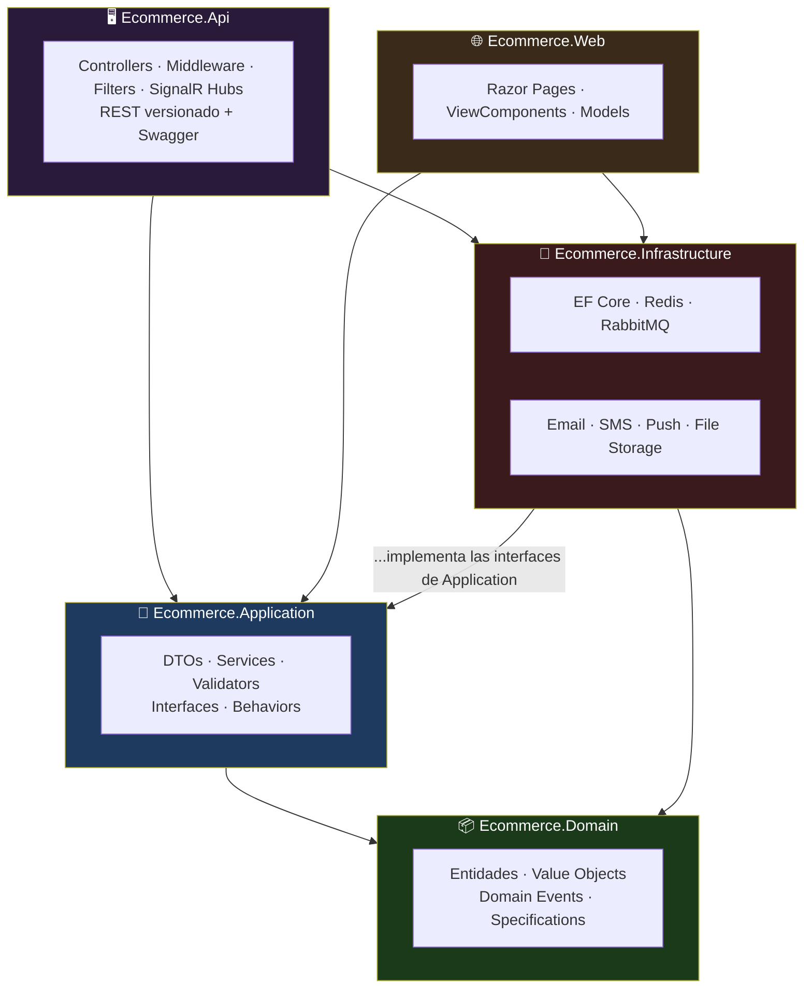
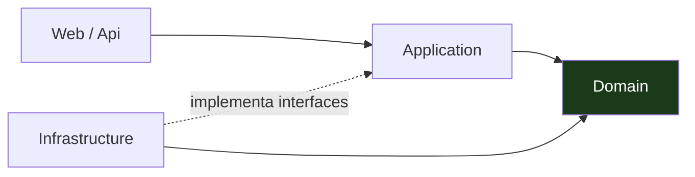
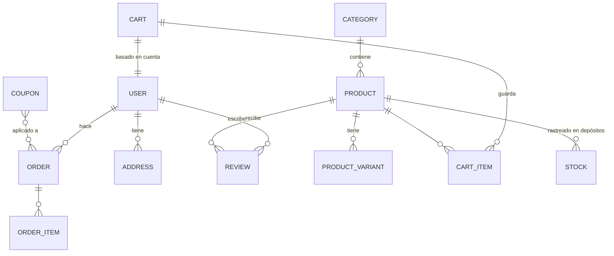
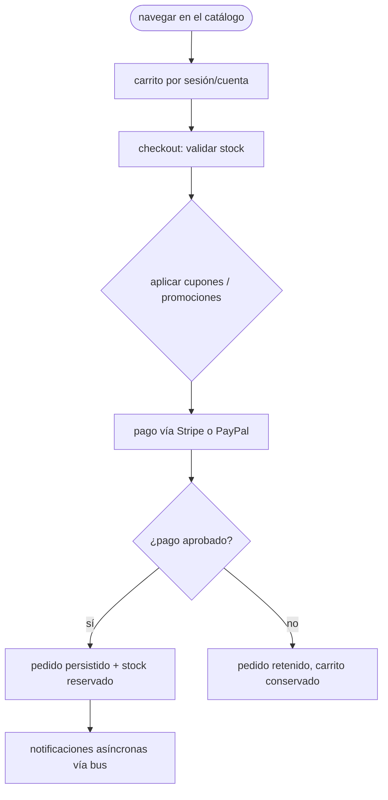
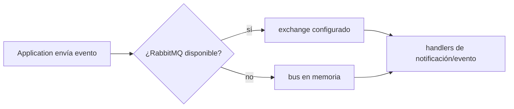

<div align="center">

**🌐 Choose Language / Selecione o Idioma / Elija el Idioma**

[](README.md)&nbsp;&nbsp;&nbsp;[](README_PT.md)&nbsp;&nbsp;&nbsp;[](README_ES.md)

</div>

---

<div align="center">

```
███████╗ ██████╗ ██████╗ ███╗   ███╗███╗   ███╗███████╗██████╗  ██████╗███████╗
██╔════╝██╔════╝██╔═══██╗████╗ ████║████╗ ████║██╔════╝██╔══██╗██╔════╝██╔════╝
█████╗  ██║     ██║   ██║██╔████╔██║██╔████╔██║█████╗  ██████╔╝██║     █████╗
██╔══╝  ██║     ██║   ██║██║╚██╔╝██║██║╚██╔╝██║██╔══╝  ██╔══██╗██║     ██╔══╝
███████╗╚██████╗╚██████╔╝██║ ╚═╝ ██║██║ ╚═╝ ██║███████╗██║  ██║╚██████╗███████╗
╚══════╝ ╚═════╝  ╚═════╝ ╚═╝     ╚═╝╚═╝     ╚═╝╚══════╝╚═╝  ╚═╝ ╚═════╝╚══════╝
        E-commerce completo — .NET 8, Clean Architecture y C# moderno
```

---

[](https://dotnet.microsoft.com/)
[](https://dotnet.microsoft.com/)
[]()
[]()
[]()
[]()
[]()

<br/>

> **Una solución de e-commerce completa — capas limpias del catálogo al checkout, pagos, inventario,
> CMS y notificaciones.** API REST versionada + Swagger por un lado, tienda MVC/Razor Pages por el otro,
> Redis/RabbitMQ con failover local para que la solución corra incluso sin infraestructura externa.

<br/>

-512BD4?style=flat-square)


</div>

---

## 📑 Índice

<details>
<summary>▶️ <strong>Haz clic para expandir / contraer esta sección</strong></summary>

<table>
<tr>
<td valign="top" width="50%">

**🏗️ Sistema**
- [Visión General](#-visión-general)
- [Arquitectura del Sistema](#-arquitectura-del-sistema)
- [Stack Tecnológica](#-stack-tecnológica)
- [Patrones de Diseño](#-patrones-de-diseño-aplicados)
- [Estructura del Proyecto](#-estructura-del-proyecto)

**📦 Módulos**
- [Ecommerce.Domain — Núcleo de Negocio](#-ecommercedomain--núcleo-de-negocio)
- [Ecommerce.Application — Casos de Uso](#-ecommerceapplication--casos-de-uso)
- [Ecommerce.Infrastructure — Adaptadores](#-ecommerceinfrastructure--adaptadores)
- [Ecommerce.Api — REST](#-ecommerceapi--rest)
- [Ecommerce.Web — Tienda](#-ecommerceweb--tienda)

**💼 Negocio**
- [Reglas de Negocio](#-reglas-de-negocio)
- [Requisitos Funcionales](#-requisitos-funcionales)
- [Requisitos No Funcionales](#-requisitos-no-funcionales)

</td>
<td valign="top" width="50%">

**📐 Diseño**
- [Modelo de Datos](#-modelo-de-datos)
- [Flujos del Sistema](#-flujos-del-sistema)

**🔐 Seguridad & Operación**
- [Seguridad](#-seguridad)
- [Instalación & Ejecución](#-instalación--ejecución)
- [Pruebas Automatizadas](#-pruebas-automatizadas)
- [Métricas & Monitoreo](#-métricas--monitoreo)
- [Limitaciones Conocidas](#-limitaciones-conocidas)

</td>
</tr>
</table>

---

</details>

## 🌟 Visión General

<details>
<summary>▶️ <strong>Haz clic para expandir / contraer esta sección</strong></summary>

**E-Commerce Platform** es una solución completa de e-commerce construida con **.NET 8**, **Clean Architecture** y práctica moderna de C# — catálogo de productos con categorías, marcas, variantes y búsqueda; carrito por sesión y por cuenta; procesamiento de pedidos con seguimiento e historial; pagos con **Stripe y PayPal**; gestión de usuarios con perfiles y direcciones; marketing con cupones, promociones, banners y newsletters; reseñas de producto, inventario de depósito, un CMS para páginas/menús/configuración/medios, y notificaciones vía **SendGrid, SMS (Twilio) y push**.

Dos superficies comparten un backend: una **API REST versionada con Swagger** (`Ecommerce.Api`) y una **tienda MVC con Razor Pages** (`Ecommerce.Web`). Los servicios externos (`Redis`, `RabbitMQ`) tienen fallback en memoria, así que la solución completa corre incluso sin infraestructura.

### 🎯 Objetivos del Sistema

| Objetivo | Descripción |
|----------|-------------|
| 🛍️ **Comercio de punta a punta** | Catálogo → carrito → checkout → pago → fulfillment |
| 🧱 **Clean Architecture** | Domain/Application/Infrastructure/Api/Web, las dependencias apuntan hacia adentro |
| 💳 **Pagos reales** | Stripe y PayPal detrás de una abstracción |
| 🔌 **Servicios externos con failover** | Redis/RabbitMQ caen a memoria |
| 📦 **Tienda + API completas** | Tienda MVC + API Swagger versionada |
| 🧪 **Tres capas de prueba** | Unit, integración y arquitectura garantizan las capas |

---

</details>

## 🏗️ Arquitectura del Sistema

<details>
<summary>▶️ <strong>Haz clic para expandir / contraer esta sección</strong></summary>

### Capas de la Clean Architecture



### Regla de Dependencia



Las dependencias apuntan hacia adentro: el **Domain** no sabe nada, la **Application** conoce el dominio, la **Infrastructure** adapta el mundo exterior a las interfaces de Application, y **Api/Web** son cáscaras delgadas.

---

</details>

## 🛠️ Stack Tecnológica

<details>
<summary>▶️ <strong>Haz clic para expandir / contraer esta sección</strong></summary>

| Capa | Tecnología | Propósito |
|------|-----------|-----------|
| 🧠 **Lenguaje** | C# 12 / .NET 8 | Todos los proyectos |
| 🗄️ **ORM** | Entity Framework Core 8 | Acceso a datos |
| 🖥️ **API** | ASP.NET Core 8, versionado, Swagger | REST versionado |
| 🌐 **Tienda** | Razor Pages / MVC | Frontend |
| ⚡ **Caché** | Redis con fallback en memoria | Cache-aside |
| 📨 **Mensajería** | RabbitMQ con fallback en memoria | Bus asíncrono |
| 💳 **Pagos** | Stripe + PayPal | Proveedores de checkout |
| ✉️ **Notificaciones** | SendGrid, SMS Twilio, push | Comunicaciones salientes |
| 🧪 **Pruebas** | xUnit, Moq, FluentAssertions | Unit / integración / arquitectura |
| 🐳 **Contenedores** | docker-compose (`docker/docker-compose.yml`) | Stack local completa |

---

</details>

## 📐 Patrones de Diseño Aplicados

<details>
<summary>▶️ <strong>Haz clic para expandir / contraer esta sección</strong></summary>

| Patrón | Dónde | Justificación |
|--------|-------|---------------|
| 🧱 **Capas Clean/Onion** | Estructura de la solution | Las dependencias apuntan hacia adentro; testeable, reemplazable |
| 🌀 **Inversión de dependencias** | Interfaces de Application + implementaciones de Infrastructure | Redis/RabbitMQ/Email son intercambiables por diseño |
| 📡 **Behaviors estilo CQRS** | Behaviors/validators de Application | Preocupaciones transversales (validación, logging) como pipeline |
| 🎭 **Repository + Specification** | Specifications en el dominio, acceso a datos con EF Core | La lógica de query queda cerca del dominio |
| 💳 **Estrategia de proveedor** | Abstracción de pago sobre Stripe/PayPal | Un camino de checkout, proveedores intercambiables |
| 📢 **Eventos de dominio** | Entidades de dominio | Los cambios de negocio se propagan sin acoplamiento |
| 🧷 **Adaptador de failover** | Fallbacks en memoria de caché/bus | Corre con cero infraestructura externa |

---

</details>

## 📁 Estructura del Proyecto

<details>
<summary>▶️ <strong>Haz clic para expandir / contraer esta sección</strong></summary>

```
ecommerce-csharp/
│
├── 📂 src/
│   ├── 📂 Ecommerce.Domain/          # entidades, value objects, domain events, specs
│   ├── 📂 Ecommerce.Application/     # DTOs, services, validators, interfaces, behaviors
│   ├── 📂 Ecommerce.Infrastructure/  # EF Core, Redis, RabbitMQ, email, SMS, archivos
│   ├── 📂 Ecommerce.Api/             # controllers, middleware, filters, hubs SignalR
│   └── 📂 Ecommerce.Web/             # Razor Pages, ViewComponents, models
│
├── 📂 tests/
│   ├── 📂 Ecommerce.UnitTests/       # pruebas unitarias
│   ├── 📂 Ecommerce.IntegrationTests/ # pruebas de integración
│   └── 📂 Ecommerce.ArchitectureTests/ # aplica la regla de capas
│
├── 📂 docker/
│   └── 📄 docker-compose.yml         # stack local completa
│
├── 📄 README.md                      # 🇺🇸 Inglés (principal)
├── 📄 README_PT.md                   # 🇧🇷 Portugués
└── 📄 README_ES.md                   # 🇪🇸 Español
```

---

</details>

## 📦 Módulos del Sistema

<details>
<summary>▶️ <strong>Haz clic para expandir / contraer esta sección</strong></summary>

### 📦 Ecommerce.Domain — Núcleo de Negocio

Entidades, value objects, domain events y specifications — el modelo de negocio puro, sin dependencias externas. Catálogo, carrito, pedido, inventario, reseña, marketing y entidades de CMS viven aquí.

### 🧩 Ecommerce.Application — Casos de Uso

DTOs, servicios de aplicación, validators, mapeo y behaviors de pipeline, más las **interfaces** que Infrastructure implementa. Aquí es donde los casos de uso se orquestan sin poseer nada técnico.

### 🔌 Ecommerce.Infrastructure — Adaptadores

Acceso a datos (EF Core), caché Redis, mensajería RabbitMQ, email (SendGrid), SMS (Twilio), push y almacenamiento de archivos — todo servicio externo detrás de una interfaz de Application, con fallbacks en memoria donde eso mantiene el dev local sin fricción.

### 🖥️ Ecommerce.Api — REST

Controllers, middleware, filters y hubs SignalR sirviendo una API REST **versionada** documentada por Swagger en `http://localhost:5000/swagger`.

### 🌐 Ecommerce.Web — Tienda

Tienda MVC construida con Razor Pages: páginas, ViewComponents y models consumidos por clientes, admins y editores de CMS sobre la misma capa Application que usa la API.

---

</details>

## 📋 Reglas de Negocio

<details>
<summary>▶️ <strong>Haz clic para expandir / contraer esta sección</strong></summary>

| # | Regla | Detalle |
|---|-------|---------|
| **BR-01** | La cantidad no puede exceder el inventario | El checkout valida el stock desde el seguimiento de depósito |
| **BR-02** | El carrito es por sesión o por cuenta | Carrito anónimo mantiene estado; con cuenta, persiste en la cuenta |
| **BR-03** | Pagos solo vía Stripe o PayPal | Una abstracción de pago; proveedores intercambiables |
| **BR-04** | Cupones y promociones aplican antes del pago | Descuentos calculados en el checkout y persistidos con el pedido |
| **BR-05** | Los pedidos tienen estados | Procesando → pagado → cumplido/rastreado, con historial por pedido |
| **BR-06** | Las reseñas exigen nota | Las reseñas de producto llevan nota; sin reseñas sin nota |
| **BR-07** | Newsletters y banners son dirigidos por campaña | Contenido de marketing gestionado, con alcance y programable |
| **BR-08** | Las notificaciones salen de forma asíncrona | Email/SMS/push vía bus RabbitMQ (o en memoria), nunca bloqueando el checkout |

---

</details>

## ✨ Requisitos Funcionales

<details>
<summary>▶️ <strong>Haz clic para expandir / contraer esta sección</strong></summary>

| ID | Característica | Prioridad | Estado |
|----|----------------|-----------|--------|
| **RF-01** | Catálogo: categorías, marcas, variantes, imágenes, búsqueda | 🔴 Alta | ✅ Implementado |
| **RF-02** | Carrito por sesión y por cuenta | 🔴 Alta | ✅ Implementado |
| **RF-03** | Procesamiento, seguimiento e historial de pedidos | 🔴 Alta | ✅ Implementado |
| **RF-04** | Pagos Stripe y PayPal | 🔴 Alta | ✅ Implementado |
| **RF-05** | Autenticación, perfiles, direcciones | 🔴 Alta | ✅ Implementado |
| **RF-06** | Cupones, promociones, banners, newsletters | 🟡 Media | ✅ Implementado |
| **RF-07** | Reseñas de producto con notas | 🟡 Media | ✅ Implementado |
| **RF-08** | Gestión de depósito y seguimiento de stock | 🟡 Media | ✅ Implementado |
| **RF-09** | CMS: páginas, menús, configuración, medios | 🟡 Media | ✅ Implementado |
| **RF-10** | Notificaciones: email (SendGrid), SMS, push | 🟡 Media | ✅ Implementado |
| **RF-11** | Caché Redis con fallback en memoria | 🟡 Media | ✅ Implementado |
| **RF-12** | Mensajería RabbitMQ con fallback en memoria | 🟡 Media | ✅ Implementado |
| **RF-13** | API REST versionada con Swagger | 🔴 Alta | ✅ Implementado |
| **RF-14** | Tienda MVC con Razor Pages | 🔴 Alta | ✅ Implementado |

---

</details>

## ⚙️ Requisitos No Funcionales

<details>
<summary>▶️ <strong>Haz clic para expandir / contraer esta sección</strong></summary>

| ID | Categoría | Requisito | Meta |
|----|-----------|-----------|------|
| **RNF-01** | 🧱 Mantenibilidad | Capas de Clean Architecture validadas por prueba | Pruebas de arquitectura en CI |
| **RNF-02** | ⚡ Rendimiento | Cache-aside con Redis, carga perezosa del DB | Lecturas cacheadas, escrituras asíncronas |
| **RNF-03** | 🔌 Portabilidad | Servicios externos intercambiables | Failsafe de caché/bus en memoria |
| **RNF-04** | 🌐 Estabilidad de la API | Endpoints versionados | Cambios que rompen detrás de nuevas versiones |
| **RNF-05** | 📐 Consistencia | Migraciones de EF Core | `dotnet ef database update` |
| **RNF-06** | 🧪 Portón de calidad | Tres capas de prueba | Unit + integración + arquitectura |
| **RNF-07** | 🐳 Reproducibilidad | Stack local en contenedores | `docker-compose up --build` |

---

</details>

## 🗄️ Modelo de Datos

<details>
<summary>▶️ <strong>Haz clic para expandir / contraer esta sección</strong></summary>

### Agregados



| Agregado | Reglas clave |
|----------|--------------|
| **Product / Variant** | Núcleo del catálogo — categorías, marcas, imágenes, referencia de stock |
| **Cart** | Por sesión o cuenta; los ítems referencian variantes del producto |
| **Order** | Snapshot del checkout, máquina de estados del pago, historial |
| **User / Address** | Autenticación, perfiles, direcciones de envío |
| **Review** | Nota del producto con texto |
| **Inventory** | Depósito + niveles de stock limitan las cantidades compradas |
| **Marketing / CMS** | Cupones, promociones, banners, newsletters, páginas, menús, medios |

---

</details>

## 🔄 Flujos del Sistema

<details>
<summary>▶️ <strong>Haz clic para expandir / contraer esta sección</strong></summary>

### Flujo de Checkout



### Flujo del Bus (con failover)



---

</details>

## 🔐 Seguridad

<details>
<summary>▶️ <strong>Haz clic para expandir / contraer esta sección</strong></summary>

### Controles Implementados

| Control | Implementación | Efecto |
|---------|---------------|--------|
| 🔑 **Autenticación** | Identidad/gestión de usuarios de ASP.NET Core | Perfiles, direcciones, roles |
| 💳 **Abstracción de pago** | Flujos server-side de Stripe/PayPal | Sin dato de tarjeta crudo en la aplicación |
| 📁 **Pipeline de validación** | Validators + behaviors de Application | Peticiones malformadas rechazadas en la frontera |
| 🧪 **Pruebas de arquitectura** | Aplican la regla de dependencia de Clean Architecture | Sin fuga de dependencia hacia adentro en CI |
| 🔌 **Secretos en config** | Connection strings/claves vía `appsettings.json` | Configuración controlada por entorno |

### Limitaciones de Seguridad Conocidas

| Limitación | Riesgo | Camino de mitigación |
|------------|--------|----------------------|
| 🛰️ **Secretos por config** | Claves de producción en `appsettings` se filtrarían | Mover a user-secrets / variables de entorno o un vault |
| 🔓 **Sin rate limiting** | Endpoints públicos abiertos al abuso | Agregar middleware de rate limiting / throttling |

---

</details>

## 🚀 Instalación & Ejecución

<details>
<summary>▶️ <strong>Haz clic para expandir / contraer esta sección</strong></summary>

### Cómo Empezar

```bash
# 1. Clona el repositorio
# 2. Configura las connection strings en appsettings.json
dotnet restore && dotnet build
dotnet ef database update        # ejecuta las migraciones
# 3. Inicia la API
dotnet run --project src/Ecommerce.Api
# 4. Inicia la tienda Web
dotnet run --project src/Ecommerce.Web
```

**Docs de la API:** Swagger UI en `http://localhost:5000/swagger`

### Docker

```bash
docker-compose -f docker/docker-compose.yml up --build
```

### Pruebas

```bash
dotnet test
```

---

</details>

## 🧪 Pruebas Automatizadas

<details>
<summary>▶️ <strong>Haz clic para expandir / contraer esta sección</strong></summary>

Tres capas de prueba corren con el mismo comando:

| Capa | Proyecto | Protege |
|------|----------|---------|
| 🧩 **Unit** | `Ecommerce.UnitTests` | Behaviors, services, validators aislados |
| 🔄 **Integración** | `Ecommerce.IntegrationTests` | EF Core, fallbacks de caché/bus, caminos reales de petición |
| 🏛️ **Arquitectura** | `Ecommerce.ArchitectureTests` | Regla de dependencia de Clean Architecture — sin fuga hacia adentro |

```bash
dotnet test
```

---

</details>

## 📊 Métricas & Monitoreo

<details>
<summary>▶️ <strong>Haz clic para expandir / contraer esta sección</strong></summary>

| Métrica | Valor |
|---------|-------|
| Proyectos de la solution | 8 (5 src + 3 test) |
| Archivos C# | 223 |
| Capas de arquitectura | 5 (Domain, Application, Infrastructure, API, Web) |
| Proveedores de pago | 2 (Stripe, PayPal) |
| Mensajería | RabbitMQ + fallback en memoria |
| Caché | Redis + fallback en memoria |
| Canales de notificación | Email (SendGrid), SMS (Twilio), push |
| Capas de prueba | 3 (unit, integración, arquitectura) |
| API | REST versionada + Swagger |
| Tienda | MVC Razor Pages |

### Comandos Rápidos

```bash
dotnet restore && dotnet build
dotnet ef database update
dotnet run --project src/Ecommerce.Api
dotnet run --project src/Ecommerce.Web
dotnet test
docker-compose -f docker/docker-compose.yml up --build
```

---

</details>

## ⚠️ Limitaciones Conocidas

<details>
<summary>▶️ <strong>Haz clic para expandir / contraer esta sección</strong></summary>

| Categoría | Problema | Estado |
|-----------|----------|--------|
| 💳 **Claves de pago en vivo** | Stripe/PayPal corren en modo test/sandbox hasta configurar claves de producción | ⚠️ Basado en configuración |
| 📦 **Fallbacks en memoria** | Los fallbacks de Redis/RabbitMQ son perfectos para dev, no para topología distribuida de producción | ⚠️ Conveniencia de dev |
| 🔄 **Resiliencia asíncrona** | Todavía sin patrón de outbox/retry para eventos del bus | ⚠️ Trabajo futuro |
| 📱 **Sin cliente mobile/SPA** | La tienda es MVC; la API está lista para otros clientes | ⚠️ Fuera de alcance |

</details>

---

<div align="center">

---

### 🛒 E-Commerce Platform

*Del catálogo al checkout, arquitectura limpia en el medio.*

[]()
[]()
[]()

<br/>

```
"El Domain no sabe nada; todo servicio externo es un adaptador."
```

</div>