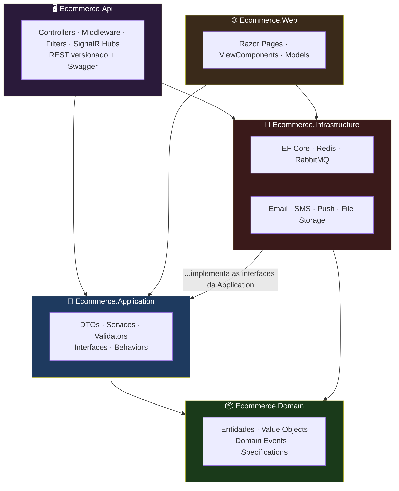
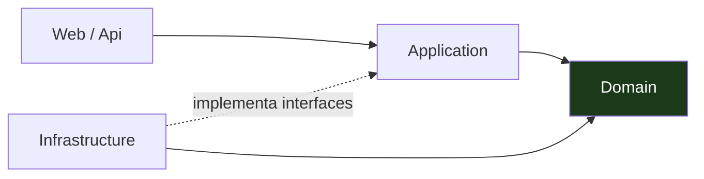
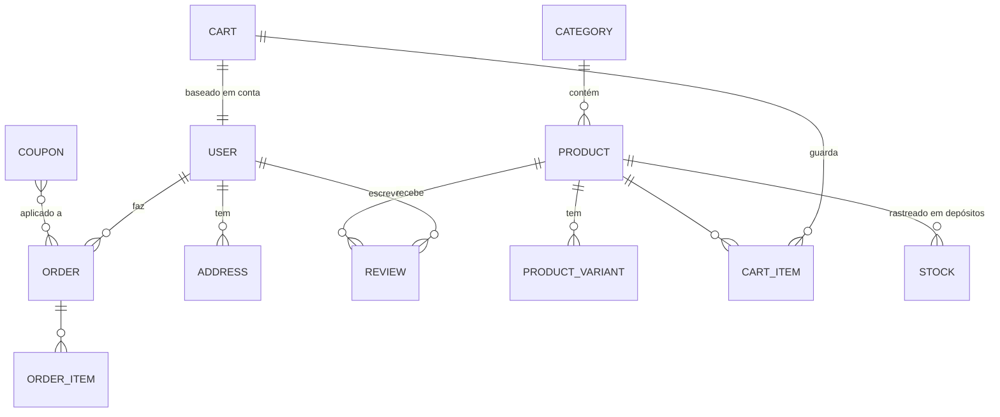
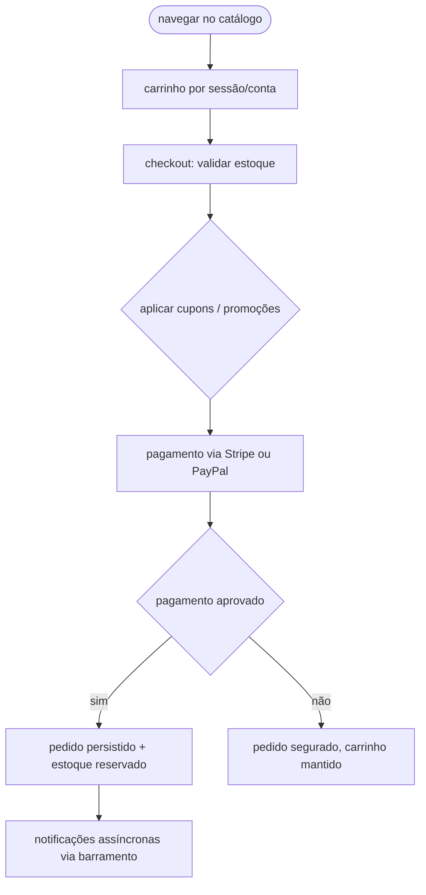
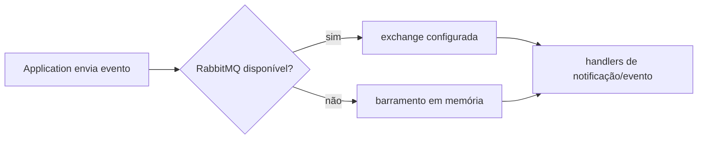

<div align="center">

**🌐 Choose Language / Selecione o Idioma / Elija el Idioma**

[](README.md)&nbsp;&nbsp;&nbsp;[](README_PT.md)&nbsp;&nbsp;&nbsp;[](README_ES.md)

</div>

---

<div align="center">

```
███████╗ ██████╗ ██████╗ ███╗   ███╗███╗   ███╗███████╗██████╗  ██████╗███████╗
██╔════╝██╔════╝██╔═══██╗████╗ ████║████╗ ████║██╔════╝██╔══██╗██╔════╝██╔════╝
█████╗  ██║     ██║   ██║██╔████╔██║██╔████╔██║█████╗  ██████╔╝██║     █████╗
██╔══╝  ██║     ██║   ██║██║╚██╔╝██║██║╚██╔╝██║██╔══╝  ██╔══██╗██║     ██╔══╝
███████╗╚██████╗╚██████╔╝██║ ╚═╝ ██║██║ ╚═╝ ██║███████╗██║  ██║╚██████╗███████╗
╚══════╝ ╚═════╝  ╚═════╝ ╚═╝     ╚═╝╚═╝     ╚═╝╚══════╝╚═╝  ╚═╝ ╚═════╝╚══════╝
   E-commerce completo — .NET 8, Clean Architecture e C# moderno
```

---

[](https://dotnet.microsoft.com/)
[](https://dotnet.microsoft.com/)
[]()
[]()
[]()
[]()
[]()

<br/>

> **Uma solução de e-commerce completa — camadas limpas do catálogo ao checkout, pagamentos,
> estoque, CMS e notificações.** API REST versionada + Swagger de um lado, loja MVC/Razor Pages do
> outro, Redis/RabbitMQ com fallback local para a solução rodar até sem infraestrutura externa.

<br/>

-512BD4?style=flat-square)


</div>

---

## 📑 Índice

<details>
<summary>▶️ <strong>Clique para expandir / recolher esta seção</strong></summary>

<table>
<tr>
<td valign="top" width="50%">

**🏗️ Sistema**
- [Visão Geral](#-visão-geral)
- [Arquitetura do Sistema](#-arquitetura-do-sistema)
- [Stack Tecnológica](#-stack-tecnológica)
- [Padrões de Projeto](#-padrões-de-projeto-aplicados)
- [Estrutura do Projeto](#-estrutura-do-projeto)

**📦 Módulos**
- [Ecommerce.Domain — Núcleo de Negócio](#-ecommercedomain--núcleo-de-negócio)
- [Ecommerce.Application — Casos de Uso](#-ecommerceapplication--casos-de-uso)
- [Ecommerce.Infrastructure — Adaptadores](#-ecommerceinfrastructure--adaptadores)
- [Ecommerce.Api — REST](#-ecommerceapi--rest)
- [Ecommerce.Web — Loja](#-ecommerceweb--loja)

**💼 Negócio**
- [Regras de Negócio](#-regras-de-negócio)
- [Requisitos Funcionais](#-requisitos-funcionais)
- [Requisitos Não Funcionais](#-requisitos-não-funcionais)

</td>
<td valign="top" width="50%">

**📐 Design**
- [Modelo de Dados](#-modelo-de-dados)
- [Fluxos do Sistema](#-fluxos-do-sistema)

**🔐 Segurança & Operação**
- [Segurança](#-segurança)
- [Instalação & Execução](#-instalação--execução)
- [Testes Automatizados](#-testes-automatizados)
- [Métricas & Monitoramento](#-métricas--monitoramento)
- [Limitações Conhecidas](#-limitações-conhecidas)

</td>
</tr>
</table>

---

</details>

## 🌟 Visão Geral

<details>
<summary>▶️ <strong>Clique para expandir / recolher esta seção</strong></summary>

**E-Commerce Platform** é uma solução completa de e-commerce construída com **.NET 8**, **Clean Architecture** e prática moderna de C# — catálogo de produtos com categorias, marcas, variantes e busca; carrinho por sessão e por conta; processamento de pedidos com rastreio e histórico; pagamentos com **Stripe e PayPal**; gerenciamento de usuários com perfis e endereços; marketing com cupons, promoções, banners e newsletters; avaliações de produto, estoque em depósito, um CMS para páginas/menus/configurações/mídia, e notificações via **SendGrid, SMS (Twilio) e push**.

Duas superfícies compartilham um backend: uma **API REST versionada com Swagger** (`Ecommerce.Api`) e uma **loja MVC com Razor Pages** (`Ecommerce.Web`). Serviços externos (`Redis`, `RabbitMQ`) têm fallback em memória, então a solução inteira roda mesmo sem infraestrutura.

### 🎯 Objetivos do Sistema

| Objetivo | Descrição |
|----------|-----------|
| 🛍️ **Comércio ponta a ponta** | Catálogo → carrinho → checkout → pagamento → fulfillment |
| 🧱 **Clean Architecture** | Domain/Application/Infrastructure/Api/Web, dependências apontam para dentro |
| 💳 **Pagamentos reais** | Stripe e PayPal atrás de uma abstração |
| 🔌 **Serviços externos com failover** | Redis/RabbitMQ caem para em memória |
| 📦 **Loja + API completas** | Loja MVC + API Swagger versionada |
| 🧪 **Três camadas de teste** | Unit, integração e arquitetura garantem as camadas |

---

</details>

## 🏗️ Arquitetura do Sistema

<details>
<summary>▶️ <strong>Clique para expandir / recolher esta seção</strong></summary>

### Camadas da Clean Architecture



### Regra de Dependência



As dependências apontam para dentro: o **Domain** não sabe de nada, a **Application** conhece o domínio, a **Infrastructure** adapta o mundo externo às interfaces da Application, e **Api/Web** são cascas finas.

---

</details>

## 🛠️ Stack Tecnológica

<details>
<summary>▶️ <strong>Clique para expandir / recolher esta seção</strong></summary>

| Camada | Tecnologia | Propósito |
|--------|-----------|-----------|
| 🧠 **Linguagem** | C# 12 / .NET 8 | Todos os projetos |
| 🗄️ **ORM** | Entity Framework Core 8 | Acesso a dados |
| 🖥️ **API** | ASP.NET Core 8, versionamento, Swagger | REST versionado |
| 🌐 **Loja** | Razor Pages / MVC | Frontend |
| ⚡ **Cache** | Redis com fallback em memória | Cache-aside |
| 📨 **Mensageria** | RabbitMQ com fallback em memória | Barramento assíncrono |
| 💳 **Pagamentos** | Stripe + PayPal | Provedores de checkout |
| ✉️ **Notificações** | SendGrid, SMS Twilio, push | Comunicações de saída |
| 🧪 **Testes** | xUnit, Moq, FluentAssertions | Unit / integração / arquitetura |
| 🐳 **Containers** | docker-compose (`docker/docker-compose.yml`) | Stack local completa |

---

</details>

## 📐 Padrões de Projeto Aplicados

<details>
<summary>▶️ <strong>Clique para expandir / recolher esta seção</strong></summary>

| Padrão | Onde | Justificativa |
|--------|------|---------------|
| 🧱 **Camadas Clean/Onion** | Estrutura da solution | Dependências apontam para dentro; testável, trocável |
| 🌀 **Inversão de dependência** | Interfaces da Application + implementações da Infrastructure | Redis/RabbitMQ/Email são trocáveis por design |
| 📡 **Behaviors estilo CQRS** | Behaviors/validators da Application | Preocupações transversais (validação, logging) como pipeline |
| 🎭 **Repository + Specification** | Specifications no domínio, acesso a dados com EF Core | Lógica de query fica perto do domínio |
| 💳 **Estratégia de provedor** | Abstração de pagamento sobre Stripe/PayPal | Um caminho de checkout, provedores intercambiáveis |
| 📢 **Domain events** | Entidades de domínio | Mudanças de negócio propagam sem acoplamento |
| 🧷 **Adaptador de failover** | Fallbacks em memória de cache/barramento | Roda com zero infraestrutura externa |

---

</details>

## 📁 Estrutura do Projeto

<details>
<summary>▶️ <strong>Clique para expandir / recolher esta seção</strong></summary>

```
ecommerce-csharp/
│
├── 📂 src/
│   ├── 📂 Ecommerce.Domain/          # entidades, value objects, domain events, specs
│   ├── 📂 Ecommerce.Application/     # DTOs, services, validators, interfaces, behaviors
│   ├── 📂 Ecommerce.Infrastructure/  # EF Core, Redis, RabbitMQ, email, SMS, arquivos
│   ├── 📂 Ecommerce.Api/             # controllers, middleware, filters, hubs SignalR
│   └── 📂 Ecommerce.Web/             # Razor Pages, ViewComponents, models
│
├── 📂 tests/
│   ├── 📂 Ecommerce.UnitTests/       # testes unitários
│   ├── 📂 Ecommerce.IntegrationTests/ # testes de integração
│   └── 📂 Ecommerce.ArchitectureTests/ # aplica a regra de camadas
│
├── 📂 docker/
│   └── 📄 docker-compose.yml         # stack local completa
│
├── 📄 README.md                      # 🇺🇸 Inglês (principal)
├── 📄 README_PT.md                   # 🇧🇷 Português
└── 📄 README_ES.md                   # 🇪🇸 Espanhol
```

---

</details>

## 📦 Módulos do Sistema

<details>
<summary>▶️ <strong>Clique para expandir / recolher esta seção</strong></summary>

### 📦 Ecommerce.Domain — Núcleo de Negócio

Entidades, value objects, domain events e specifications — o modelo de negócio puro, sem dependências externas. Catálogo, carrinho, pedido, estoque, avaliação, marketing e entidades de CMS vivem aqui.

### 🧩 Ecommerce.Application — Casos de Uso

DTOs, services de aplicação, validators, mapeamento e behaviors de pipeline, mais as **interfaces** que a Infrastructure implementa. É aqui que os casos de uso são orquestrados sem possuir nada técnico.

### 🔌 Ecommerce.Infrastructure — Adaptadores

Acesso a dados (EF Core), cache Redis, mensageria RabbitMQ, email (SendGrid), SMS (Twilio), push e armazenamento de arquivos — todo serviço externo atrás de uma interface da Application, com fallbacks em memória onde isso mantém o dev local sem atrito.

### 🖥️ Ecommerce.Api — REST

Controllers, middleware, filters e hubs SignalR servindo uma API REST **versionada** documentada por Swagger em `http://localhost:5000/swagger`.

### 🌐 Ecommerce.Web — Loja

Loja MVC construída com Razor Pages: páginas, ViewComponents e models consumidos por clientes, admins e editores de CMS sobre a mesma camada Application que a API usa.

---

</details>

## 📋 Regras de Negócio

<details>
<summary>▶️ <strong>Clique para expandir / recolher esta seção</strong></summary>

| # | Regra | Detalhe |
|---|-------|---------|
| **BR-01** | Quantidade não pode exceder o estoque | O checkout valida o estoque a partir do rastreio de depósito |
| **BR-02** | Carrinho é por sessão ou por conta | Carrinho anônimo mantém estado; logado persiste na conta |
| **BR-03** | Pagamento só via Stripe ou PayPal | Uma abstração de pagamento; provedores intercambiáveis |
| **BR-04** | Cupons e promoções aplicam antes do pagamento | Descontos calculados no checkout e persistidos com o pedido |
| **BR-05** | Pedidos têm estados | Processando → pago → cumprido/rastreado, com histórico por pedido |
| **BR-06** | Avaliações exigem nota | Reviews de produto carregam nota; sem review sem nota |
| **BR-07** | Newsletters e banners são dirigidos por campanha | Conteúdo de marketing gerenciado, escopado e agendável |
| **BR-08** | Notificações fan-out assíncrono | Email/SMS/push via barramento RabbitMQ (ou em memória), nunca bloqueando o checkout |

---

</details>

## ✨ Requisitos Funcionais

<details>
<summary>▶️ <strong>Clique para expandir / recolher esta seção</strong></summary>

| ID | Feature | Prioridade | Status |
|----|---------|------------|--------|
| **RF-01** | Catálogo: categorias, marcas, variantes, imagens, busca | 🔴 Alta | ✅ Implementado |
| **RF-02** | Carrinho por sessão e por conta | 🔴 Alta | ✅ Implementado |
| **RF-03** | Processamento, rastreio e histórico de pedidos | 🔴 Alta | ✅ Implementado |
| **RF-04** | Pagamentos Stripe e PayPal | 🔴 Alta | ✅ Implementado |
| **RF-05** | Autenticação, perfis, endereços | 🔴 Alta | ✅ Implementado |
| **RF-06** | Cupons, promoções, banners, newsletters | 🟡 Média | ✅ Implementado |
| **RF-07** | Avaliações de produto com notas | 🟡 Média | ✅ Implementado |
| **RF-08** | Gerenciamento de depósito e rastreio de estoque | 🟡 Média | ✅ Implementado |
| **RF-09** | CMS: páginas, menus, configurações, mídia | 🟡 Média | ✅ Implementado |
| **RF-10** | Notificações: email (SendGrid), SMS, push | 🟡 Média | ✅ Implementado |
| **RF-11** | Cache Redis com fallback em memória | 🟡 Média | ✅ Implementado |
| **RF-12** | Mensageria RabbitMQ com fallback em memória | 🟡 Média | ✅ Implementado |
| **RF-13** | API REST versionada com Swagger | 🔴 Alta | ✅ Implementado |
| **RF-14** | Loja MVC com Razor Pages | 🔴 Alta | ✅ Implementado |

---

</details>

## ⚙️ Requisitos Não Funcionais

<details>
<summary>▶️ <strong>Clique para expandir / recolher esta seção</strong></summary>

| ID | Categoria | Requisito | Meta |
|----|-----------|-----------|------|
| **RNF-01** | 🧱 Manutenibilidade | Camadas da Clean Architecture validadas por teste | Testes de arquitetura no CI |
| **RNF-02** | ⚡ Performance | Cache-aside com Redis, load preguiçoso do DB | Leituras cacheadas, escritas assíncronas |
| **RNF-03** | 🔌 Portabilidade | Serviços externos trocáveis | Failsafe de cache/barramento em memória |
| **RNF-04** | 🌐 Estabilidade da API | Endpoints versionados | Mudanças que quebram ficam atrás de novas versões |
| **RNF-05** | 📐 Consistência | Migrações do EF Core | `dotnet ef database update` |
| **RNF-06** | 🧪 Portão de qualidade | Três camadas de teste | Unit + integração + arquitetura |
| **RNF-07** | 🐳 Reproduzibilidade | Stack local em containers | `docker-compose up --build` |

---

</details>

## 🗄️ Modelo de Dados

<details>
<summary>▶️ <strong>Clique para expandir / recolher esta seção</strong></summary>

### Agregados



| Agregado | Regras-chave |
|----------|--------------|
| **Product / Variant** | Núcleo do catálogo — categorias, marcas, imagens, referência de estoque |
| **Cart** | Por sessão ou conta, itens referenciam variantes do produto |
| **Order** | Snapshot do checkout, máquina de estados de pagamento, histórico |
| **User / Address** | Autenticação, perfis, endereços de entrega |
| **Review** | Nota do produto com texto |
| **Inventory** | Depósito + níveis de estoque limitam quantidades compradas |
| **Marketing / CMS** | Cupons, promoções, banners, newsletters, páginas, menus, mídia |

---

</details>

## 🔄 Fluxos do Sistema

<details>
<summary>▶️ <strong>Clique para expandir / recolher esta seção</strong></summary>

### Fluxo de Checkout



### Fluxo do Barramento (com failover)



---

</details>

## 🔐 Segurança

<details>
<summary>▶️ <strong>Clique para expandir / recolher esta seção</strong></summary>

### Controles Implementados

| Control | Implementação | Efeito |
|---------|---------------|--------|
| 🔑 **Autenticação** | Identidade/gerenciamento de usuários do ASP.NET Core | Perfis, endereços, papéis |
| 💳 **Abstração de pagamento** | Fluxos server-side Stripe/PayPal | Sem dado de cartão cru na aplicação |
| 📁 **Pipeline de validação** | Validators + behaviors da Application | Requisições malformadas rejeitadas na fronteira |
| 🧪 **Testes de arquitetura** | Aplicam a regra de dependência da Clean Architecture | Sem vazamento de dependência para dentro no CI |
| 🔌 **Segredos em config** | Connection strings/chaves via `appsettings.json` | Configuração controlada por ambiente |

### Limitações de Segurança Conhecidas

| Limitação | Risco | Caminho de mitigação |
|-----------|-------|----------------------|
| 🛰️ **Segredos por config** | Chaves de produção em `appsettings` vazariam | Mover para user-secrets / variáveis de ambiente ou um cofre |
| 🔓 **Sem rate limit** | Endpoints públicos abertos a abuso | Adicionar middleware de rate limiting / throttling |

---

</details>

## 🚀 Instalação & Execução

<details>
<summary>▶️ <strong>Clique para expandir / recolher esta seção</strong></summary>

### Começando

```bash
# 1. Clone o repositório
# 2. Configure as connection strings em appsettings.json
dotnet restore && dotnet build
dotnet ef database update        # roda as migrações
# 3. Inicie a API
dotnet run --project src/Ecommerce.Api
# 4. Inicie a loja Web
dotnet run --project src/Ecommerce.Web
```

**Docs da API:** Swagger UI em `http://localhost:5000/swagger`

### Docker

```bash
docker-compose -f docker/docker-compose.yml up --build
```

### Testes

```bash
dotnet test
```

---

</details>

## 🧪 Testes Automatizados

<details>
<summary>▶️ <strong>Clique para expandir / recolher esta seção</strong></summary>

Três camadas de teste rodam com o mesmo comando:

| Camada | Projeto | Protege |
|--------|---------|---------|
| 🧩 **Unit** | `Ecommerce.UnitTests` | Behaviors, services, validators isolados |
| 🔄 **Integração** | `Ecommerce.IntegrationTests` | EF Core, fallbacks de cache/barramento, caminhos reais de requisição |
| 🏛️ **Arquitetura** | `Ecommerce.ArchitectureTests` | Regra de dependência da Clean Architecture — sem vazamento para dentro |

```bash
dotnet test
```

---

</details>

## 📊 Métricas & Monitoramento

<details>
<summary>▶️ <strong>Clique para expandir / recolher esta seção</strong></summary>

| Métrica | Valor |
|---------|-------|
| Projetos da solution | 8 (5 src + 3 test) |
| Arquivos C# | 223 |
| Camadas de arquitetura | 5 (Domain, Application, Infrastructure, API, Web) |
| Provedores de pagamento | 2 (Stripe, PayPal) |
| Mensageria | RabbitMQ + fallback em memória |
| Cache | Redis + fallback em memória |
| Canais de notificação | Email (SendGrid), SMS (Twilio), push |
| Camadas de teste | 3 (unit, integração, arquitetura) |
| API | REST versionada + Swagger |
| Loja | MVC Razor Pages |

### Comandos Rápidos

```bash
dotnet restore && dotnet build
dotnet ef database update
dotnet run --project src/Ecommerce.Api
dotnet run --project src/Ecommerce.Web
dotnet test
docker-compose -f docker/docker-compose.yml up --build
```

---

</details>

## ⚠️ Limitações Conhecidas

<details>
<summary>▶️ <strong>Clique para expandir / recolher esta seção</strong></summary>

| Categoria | Problema | Status |
|-----------|----------|--------|
| 💳 **Chaves de pagamento ao vivo** | Stripe/PayPal rodam em modo teste/sandbox até configurar chaves de produção | ⚠️ Baseado em configuração |
| 📦 **Fallbacks em memória** | Fallbacks de Redis/RabbitMQ são perfeitos para dev, não para topologia distribuída de produção | ⚠️ Conveniência de dev |
| 🔄 **Resiliência assíncrona** | Ainda sem padrão de outbox/retry para eventos do barramento | ⚠️ Trabalho futuro |
| 📱 **Sem cliente mobile/SPA** | Loja é MVC; a API está pronta para outros clientes | ⚠️ Fora de escopo |

</details>

---

<div align="center">

---

### 🛒 E-Commerce Platform

*Do catálogo ao checkout, arquitetura limpa no meio.*

[]()
[]()
[]()

<br/>

```
"O Domain não sabe de nada; todo serviço externo é um adaptador."
```

</div>